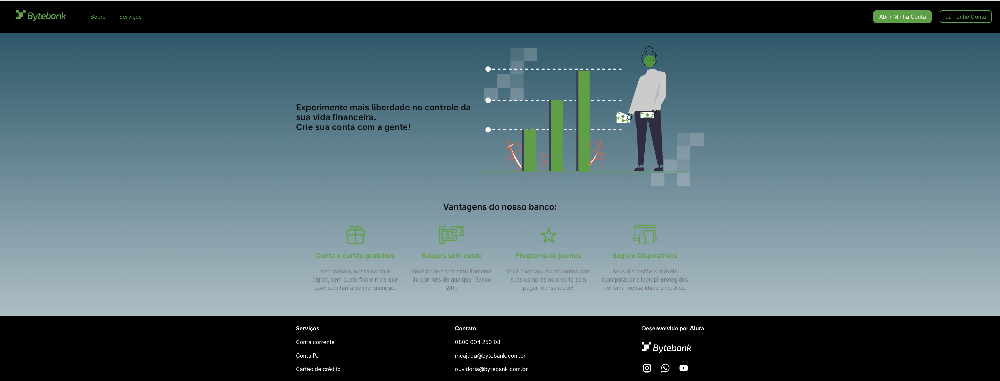

# Tech Challenge - Landing Page

## Projeto Financeiro

Projeto desenvolvido pelos alunos:

- Cristiano Santos Gonçalves - RM 358858

- Isabella Soares de Lima - RM 358599

## Sobre este projeto

Este repositório contém o projeto Landing Page e é um microfrontend remoto da aplicação. No momento, já que ainda não implementamos o fluxo de login, ele não está integrado na aplicação entregue até agora.

## Como executar o projeto

Instale as dependências e execute o projeto:

```
npm i
npm run dev
```

A aplicação deve executar na url `http://localhost:3000`.


